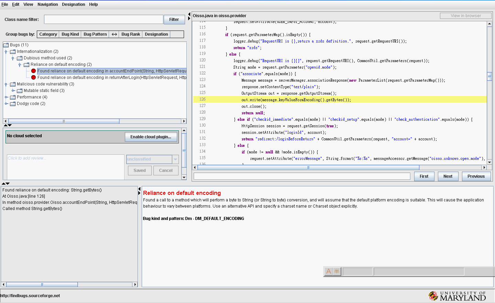

<!-- 開始使用Maven是因為受夠了每次開始一個Project，都要重新開始撰寫 -->
Ant build.xml，雖然有過去建立的範本，但是還是的根據不同狀況加以
改寫(比如不同的打包方式，如同時deploy 到tomcat 與jboss時用到不
同的log4J設定，或是像GWT必須加上一道Comple手續);當有新版本的
Liberary出來的時候，還得忙著下載新Jar，然後發現不相容時，還得改回來…
Maven最大的好處，就是把上面的無聊事標準化，簡單化了，用久了，還真得
少不了它。

#<a name="buildMavenEnv"></a>建立Maven環境

1. 下載Mav[](http://maven.apache.org/download.html)en後，解開到目錄，例 x:\maven\ 
2. 決定您電腦的函式庫(Maven 把所有Libery集中管理)所在，預設在 用戶目錄/.m2，若要變更不同位置，修改 x:\maven\conf\settings.xml的<localRepository>設定 
3. 設定環境變數 M2_HOME 指到 Maven目錄，並且將 Maven目錄下的 bin加到執行路徑

#<a name="firstProject"></a>用Maven建立第一個Project

在命令視窗執行 mvn archetype:generate 命令，使用互動方式建立Project， 會依序問幾個問題 

| Choose archetype: | 選擇建立Project的範本，預設是99:maven-archetype-quickstart建立一個最基本的Project |
| ------------- | ------------- |
| Choose version: | 選擇範本的版本，會列出一些範本可用的版本，其差異是就不用版本的範本可能會建立有不同的資源檔(比如可能附帶圖檔) |
| 定義groupId: | 輸入要建立Project所隸屬的組織或公司，如我自已用idv.kentyeh.software | 
| 定義artifactId: | 就是Project名稱，例如 firstMaven |
| 定義version: | Project的版本號，預設是1.0-SNAPSHOT |
| 定義package: | 初始建立的Java Package, 如 idv.kentyeh.software |

確定後建立Project的基本架構，如果您不要用互動的方式，上述動作可以以下指令完成相同的事 

```
mvn archetype:create -DgroupId=idv.kentyeh.software -DartifactId=firstmaven \
      -DpackageName=idv.kentyeh.software -DarchetypeArtifactId:maven-archetype-quickstart \
      -Dversion=1.0-SNAPSHOT
```

#<a name="identity"></a>Maven的識別管理

Maven的識別管理，分為三層 groupId:artifactId:version，一個組織(group) 可能存在多個Project(atrifact)，每個Project也可能存在多個版本(version)， 整個函式庫就以這種檔檔案架構進行處理，當使用的函式不存在時，Maven會到 http://repo1.maven.org/maven2/ 或是 http://repo2.maven.org/maven2/ 進行下載，下載後存到您電腦上的函式庫 

#<a name="projectMangement"></a>Maven 的Project管理

Maven的管理設定主要靠Pom.xml進行，打開剛才建立的Project設定檔，內容說明如下： 

```
<project xmlns="http://maven.apache.org/POM/4.0.0" 
xmlns:xsi="http://www.w3.org/2001/XMLSchema-instance"
xsi:schemaLocation="http://maven.apache.org/POM/4.0.0 http://maven.apache.org/xsd/maven-4.0.0.xsd">

    <modelVersion>4.0.0</modelVersion>
    
    <!--本Project識別-->
    <groupId>idv.kentyeh.software</groupId>
    <artifactId>firstmaven</artifactId>
    <version>1.0-SNAPSHOT</version>
    
    <packaging>jar</packaging>  <!--表示打包Project的型態,可能為Jar、war、ear或pom，若是使用了android 則為apk-->
    
    <!--以下是給工具看的,主要是本Project的資訊-->
    <name>第一個MavenProject</name>
    <url>http://sites.google.com/site/gwtmemo</url>
    
    <!--設定一些變數-->
    <properties>
        <project.build.sourceEncoding>UTF-8</project.build.sourceEncoding>
    </properties>
    
    <!--設定引用函式庫-->
    <dependencies>
        <dependency>
            <groupId>junit</groupId>
            <artifactId>junit</artifactId>
            <version>3.8.1</version>
            <scope>test</scope>
        </dependency>
    </dependencies>
    
</project>
```

首先要說明的是dependencies段落，比如說，Project內會用到 commons-loggin 的Library，我們可以在此加入新的dependency段落，

```
    <dependency>
        <groupId>commons-logging</groupId>
        <artifactId>commons-logging</artifactId>
        <version>1.1.1</version>
    </dependency>
```

不知道commons-loggin的識別資料?沒關係，到這裡查。至於scope可以不填，表示打包Project(如war,ear…)時， 引用的Library會一起被打包，Scope的值說明如下： 

| compile | Scope不填時的預設值，表示Project程式須要這個Library才能運作，所以會一併被打包 |
| ------------- | ------------- |
| provided | 表示編譯會用到，但是系統在需要的時候會提供，打包Project不要含進去，例如J2ee的Library，像是servlet-api，就是由App Server提供 |
| runtime | 表示編譯時用不到，只有執行時會用到，所以發佈程式時須要一併打包，如GWT 的 gwt-servlet.jar |
| test | 只有在單元測試時會用到，發佈程式時並不會用到，所以不會被打包 |
| system | 與provided相似，但是固定存在系統檔案,須以 systemPath 指定路徑  |

至於commons-loggin是否須要使用到其它的Library，根本完全不用在意，因為Maven會自動導入相關的Library 

#<a name="archetype"></a>Project目錄架構

以建立web程式來說，其目錄架構說明如下：

```
Project目錄
├src[程式碼目錄]
│ │
│ ├main[主要目錄]
│ │ │
│ │ ├java[java程式目錄]
│ │ │ │
│ │ │ └[idv.kentyeh.software....程式套件目錄]
│ │ │
│ │ ├resources[資源目錄,會copy到編譯路徑，以web來說，會依目錄層級放到WEB-INF/classes下]
│ │ │ │
│ │ │ └[各種資源(設定)檔...]
│ │ │
│ │ └webapp[web目錄]
│ │   │
│ │   └[其它資料…]
│ │
│ └test[測試相關目錄]
│   │
│   ├java[java測試程式目錄]
│   │ │
│   │ └[...]
│   │
│   └resources[測試資源目錄…]
│
└target[各種處理後產生的資料，包含最終生的的打包標的]
```

#<a href="thirdParty"></a>Maven 引用第三方函式庫

[之前](#identity)有說過，Maven有專門存放函式的repository (檔案庫)， 但是[ASF](http://www.apache.org/)再厲害，也不可能搜羅所有Library，所以必要的時候，我們必須引用第三方的函式檔案庫， 以下為可能會用到的來源(加入到Pom.xml)：

```
<repositories>
    <repository><!--J2ee 最新的函式庫在此-->
        <id>java.net2</id>
        <name>Repository hosting the jee6 artifacts</name>
        <url>http://download.java.net/maven/2</url>
    </repository>
</repositories>
```

#Maven Plugin

一開始的時候，我們執行 "mvn archetype:generate" 建立Project，mvn 後面接的指令 叫 goal由 "前置字:識別字" 表示要執行的作業。這些執業作業(命令)是由所謂的 plugin所提供，plugin是一種專供 Maven本身使用的Library，同一個plugin通常使用同一前置字，然後本身會帶有說明提供那些作業的自我解說檔(metadata)， 通常這個自我解說檔，也會定義每種作業隸屬於那種[phase](#phase)(作業階段)；Maven本身[早已知道](http://maven.apache.org/guides/introduction/introduction-to-the-lifecycle.html#Built-in_Lifecycle_Bindings)許許多多的goal的定義，當Maven執行特定的 goal時，缺少的Plugin，Maven就會自動去Repository下載相關的檔案。 

Maven 的指令可以串接，例如以下指令 

```
mvn clean package javadoc:javadoc exec:exec
```

表示，先刪除 target 目錄後再行打包Project，然後產生文件，再執行專案(需要額外設定)。

上述的 clean、package(打包）都很容易理解，可是為何又出現了 javadoc:javadoc、exec:exec 這樣的表示， 這是因為Plugin是Maven裡面的一種特殊專案，她裡面存在一些task，當這些Plugin被包含進專案的pom.xml時， 例如要執行maven-javadoc-plugin這個Plugin的javadoc task時，完整的命令下法應該是 

```
mvn org.apache.maven.plugins:maven-javadoc-plugin:2.10.1:javadoc
```

但是因為在的Jar的Metadata中已經標注了它的prefix，在Maven執行時，會去讀取每個plugin java的metadata， 而maven-javadoc-plugin的metadata標記為javadoc，所以才省略為 javadoc:javadoc，

至於前面的clean package 等則是[maven lifecycle](#phase)的一部分，會綁定特定的Plugin，然後執行 該Plugin的task。

plugin的定義結構通常如下 :

```
<project ...>
    ...
    <build>
        <plugins>
            <!--可定義多個plugin-->
            <plugin>
                <groupId>org.apache.maven.plugins</groupId><!--若是此值，則可省略-->
                <artifactId>maven-compiler-plugin</artifactId>
                <version>3.1</version>
                <configuration>
                ...各種設定
                </configuration>
            </plugin>
        <plugins>
        <finalName>firstmvn</finalName>
        ...
    <build>
    ...
</project>
```

#<a name="property"></a>Project變數

我們建立的第一個 Project 的 [pom.xml](#projectMangement)檔案內有一個<properties>段落，可以讓我們定義一些變數， 例如Spring 通常含有多種Library，其引用版本應該一致，所以我通常會定義一個變數 

```
<org.springframework.version>4.2.0.RELEASE</org.springframework.version>
```

然後，定義版本別的地方會寫成 

```
<version>${org.springframework.version}</version>
```

以後當版本變更的時候，只要修改&lt;properties&gt;下的&lt;org.springframework.version&gt;4.2.0.RELEASE&lt;/org.springframework.version&gt;，就可以引用新的版本。 初建立時的[pom.xm](#projectMangement)l內已經有一個變數 

```
<project.build.sourceEncoding>UTF-8</project.build.sourceEncoding>
```

為什麼沒有看到在那裡引用呢? 其實，前面已經提過，Maven的所有作業都是靠許多的Plugin來達成，雖然在這個[pom.xml](#projectMangement)內沒有看到引用任何Plugin， 但當我們執行 "mvn compile"的時候，因為Maven已經內定很多指令所使用的Plugin，所以實際上該命令會去執行 

```
mvn compiler:compile
```

而[compiler Plugin](http://maven.apache.org/plugins/maven-compiler-plugin/)，encoding會預設參考[${project.build.sourceEncoding}](http://maven.apache.org/plugins/maven-compiler-plugin/compile-mojo.html#encoding)這個變數， 所以我們在pom.xml的<properties>指定這個變數的值為"UTF-8"，所以在編譯程式時，編譯器就會知道程式使用的編碼。 [這邊](http://docs.codehaus.org/display/MAVENUSER/MavenPropertiesGuide)有列出一些預設的[變數](http://books.sonatype.com/mvnref-book/reference/resource-filtering-sect-properties.html)，可以參考使用。 最後一提的是build內可放一個finalName，一般來說打包的最後檔名為artifactId-version.war(jar,ear)，一般來說，web檔deploy時總希望固定一個名字，使用finalName與一些變數就可以將打包檔的名稱固定住， 例如，我們打包的名字不要有版本資料便可設定如下 

```
<finalName>${project.artifact}.war</finalName>
```

以下是一些預設變數的列表 

| ${basedir} | 表示包含pom.xml的目錄路徑 |
| ------------- | ------------- |
| ${version} | 等同${project.version}或${pom.version}，即程式的版本編號(maven通常建議不要直接使用${version}) |
| ${project.build.directory} | 就是target目錄，等同${pom.project.build.directory} |
| ${project.build.outputDirectory} | 就是target/classes目錄 |
| ${project.name} 或 ${pom.name} | 就是pom.xml '<name'>所指定的名稱 |
| ${project.build.finalName} | Project的打包名稱 |
| ${env.M2_HOME} | maven安裝目錄 |
| ${java.home} | Java安裝目錄 |
| ${java的系統變數} | 與其它JVM所定義的變數 |


#<a name="phase"></a>Maven pahse

之前說過goal可是設定屬於某個phase，而phase則可組成[lifecycle](http://maven.apache.org/guides/introduction/introduction-to-the-lifecycle.html#Lifecycle_Reference)(生命週期)，在Maven有三個LifeCycle?，分別是 clean 、 default 與 site ， clean周期負責Project的清理，default周期負責Project的建置而site周期則是負責產生Project的文檔。 例如執行 "mvn package" 時，因為它是屬於 defulat 這個life cycle，所以從 phase validate 到 package 的所有相關的Goals都會被執行

    Plugin可以設定它的goal屬於某個phase，所以有可能造成某個pahse下並不存在任何可以執行的goal。 

例如 "mvn package"這個Goals，由[內定的Goal](http://maven.apache.org/guides/introduction/introduction-to-the-lifecycle.html#Built-in_Lifecycle_Bindings)可以知道， 它可能會執行Goal "mvn jar:jar" 、 "mvn ejb:ejb" 或是 "mvn ejb3:ejb3"(端看您的專案引用了那些Plugin，預設是"jar:jar")， 而 "package"這個Goal是屬於 "package" 這個Phase，所以如 ... "compile"..."test"這些Phase下的Goal(如 compile、test-compile、test...)會先被執行完成後， 才會輪到 "package"這個Goal，一旦之前某個goals執行失敗就會停止，必須等到所有的goals都沒有問題才可完成打包作業。

以下列舉一些常用的指令(goals) 

| mvn clean | 進行清理作業，通常是將${project.build.directory} 砍掉 |
| ------------- | ------------- |
| mvn compile | 編譯程式 |
| mvn test | 測試程式 |
| mvn package | 打包程式 |
| mvn install | 把Project打包後，放進本地repository |
| mvn source:jar javadoc:jar install | 把源碼打包，產生文件並打包連同打包的Project一起放進本地repository，把source與文件放進repository，是為了讓IDE工具方件Debug與查看Java Api |
| mvn jetty:run或是 mvn tomcat:run | 如果是webProject，直接上起來執行 |
| mvn source:jar | 把source打包成一個jar檔 |
| mvn javadoc:javadoc | 產生java api檔案 |
| mvn javadoc:jar | 產生java api打包檔案 |
| mvn exec:exec | 執行Project(需進行一些[設定]) |
| mvn versions:display-dependency-updates | 檢查相依函式庫的版本更新狀況 |
| mvn versions:use-latest-releases | 直接將pom.xml內的版本更新到最近一版釋出(會備分舊版的pom.xml) |
| mvn versions:display-plugin-updates | 檢查Plugin的更新狀況 |

#<a name="comonConfig"></a>常用的plugin build設定

##<a name="compile"></a>Compile的設定

```
<project ...>
    <build>
        <plugins>
            <plugin>
                <groupId>org.apache.maven.plugins</groupId>
                <artifactId>maven-compiler-plugin</artifactId>
                <version>3.1</version>
                <configuration>
                    <source>${maven.compiler.source}</source>
                    <target>${maven.compiler.target}</target>
                    <encoding>${project.build.sourceEncoding}</encoding>
                </configuration>
            </plugin>
        </plugins>
    </build>
</project>
```

##<a name="testng"></a>TestNG設定

因為我不用JUnit，所以我會設定TestNG 

```
<project ...>
    <build>
        <plugins>
            <plugin>
                <groupId>org.apache.maven.plugins</groupId>
                <artifactId>maven-surefire-plugin</artifactId>
                <version>2.16</version>
                <configuration>
                    <suiteXmlFiles>
                        <suiteXmlFile>${basedir}/src/test/resources/testng.xml</suiteXmlFile>
                    </suiteXmlFiles>
                    <encoding>${project.build.sourceEncoding}</encoding>
                </configuration>
                </plugin>
        </plugins>
    </build>
</project>
```

##<a name="attachSource"></a>打包時包含源碼

像GWT用於Client Side Code的Liberary，明確要求要把源碼包入jar檔內，所以要把Source Code與gwt.xml一起包到jar檔內

```
<project ...>
    <build>
        <resources>
            <resource>
                <directory>${basedir}/src/main/java</directory><!--資源檔存放路徑-->
                <filtering>false</filtering><!--不置換資源檔內容,如果要的話見http://maven.apache.org/plugins/maven-resources-plugin/examples/filter.html-->
                <includes>
                    <include>org/gwtwidgets/Stream.gwt.xml</include>
                </includes>
            </resource>
            <resource>
                <directory>${basedir}/src/main/java</directory>
                <includes>
                    <include> **/client/*.java </include>
                </includes>
            </resource>
        </resources>
    </build>
</project>
```

##<a name="executableJar"></a>建立可執行Jar

```
<project ...>
    <build>
        <plugins>
            <plugin>
                <groupId>org.apache.maven.plugins</groupId>
                <artifactId>maven-jar-plugin</artifactId>
                <version>2.4</version>
                <configuration>
                    <archive>
                        <manifest>
                            <addClasspath>true</addClasspath>
                            <mainClass>完整類別名稱(有main方法的class)</mainClass>
                        </manifest>
                    </archive>
                </configuration>
            </plugin>
        </plugins>
    </build>
</project>
```

##<a name="singleExecutableJar"></a>建立單一可執行Jar(把所有Library一起打成一包)

```
<project ...>
    <build>
        <plugins>
            <plugin>
                <groupId>org.apache.maven.plugins</groupId>
                <artifactId>maven-assembly-plugin</artifactId>
                <version>2.4</version>
                <configuration>
                    <archive>
                        <manifest>
                            <mainClass>完整類別名稱(有main方法的class)</mainClass>
                        </manifest>
                    </archive>
                    <descriptorRefs>
                        <descriptorRef>jar-with-dependencies</descriptorRef>
                    </descriptorRefs>
                </configuration>
            </plugin>
        </plugins>
    </build>
</project>
```

##<a name="runDirect"></a>直接執行程式

```
<project ...>
    <build>
        <plugins>
            <plugin>
                <groupId>org.codehaus.mojo</groupId>
                <artifactId>exec-maven-plugin</artifactId>
                <version>1.2.1</version>
                <configuration>
                    <executable>java</executable>
                    <arguments>
                        <argument>-classpath</argument>
                        <classpath /> 
                        <argument>完整類別名稱(有main方法的class)</argument>
                    </arguments>
                </configuration>
            </plugin>
        </plugins>
    </build>
</project>
```

設定好後便可以以 "mvn exec:exec"執行程式 

##<a name="goalBinding"></a>設定goal關聯到phase

[上述](#runDirect)直接執行程式的前題是，必須是在源碼已經編譯完成的情形下，如果源碼未經compile，則會因為沒有可執行的class而發生錯誤。 當然您也可以執行 "mvn compile exec:exec"來解決這個問題，而另外一種方式就是載 exec:exec 關聯到 test 這個 phase， 所以當我們執行 "mvn test" 時，就會先進行 compile然後再執行 "exec:exec"設定如下 

```
<project ...>
    <build>
        <plugins>
            <plugin>
                <groupId>org.codehaus.mojo</groupId>
                <artifactId>exec-maven-plugin</artifactId>
                <version>1.2.1</version>
                <executions>
                    <execution><!--設定Goal的執行方式-->
                        <phase>test</phase><!--將以下Goals關聯到 test Phase-->
                        <goals>
                            <goal>exec</goal> <!--要設定的goal-->
                        </goals>
                    </execution>
                </executions>
                <configuration>
                    <executable>java</executable>
                    <arguments>
                        <argument>-classpath</argument>
                        <classpath /> 
                        <argument>完整類別名稱(有main方法的class)</argument>
                    </arguments>
                </configuration>
            </plugin>
        </plugins>
    </build>
</project>
```

##<a name="singleExecutableJar2"></a>建立單一可執行Jar

[之前](#singleExecutableJar)建立單一可執行Jar，並不會把Jar裡面的META-INF一起包進去，可是像Spring的把Schma等相關資料都放在META-INFO內， 所以必須使用其它的plugin一起將這些資料包進去，並設定關聯到"package" phase 

```
<project ...>
    <build>
        <plugins>
            <plugin>
                <groupId>org.apache.maven.plugins</groupId>
                <artifactId>maven-shade-plugin</artifactId>
                <version>2.1</version>
                <executions>
                    <execution>
                        <phase>package</phase>
                        <goals>
                            <goal>shade</goal>
                        </goals>
                        <configuration>
                            <transformers>
                                <transformer implementation="org.apache.maven.plugins.shade.resource.ManifestResourceTransformer">
                                    <mainClass>完整類別名稱</mainClass>
                                </transformer>
                                <transformer implementation="org.apache.maven.plugins.shade.resource.AppendingTransformer">
                                    <resource>META-INF/spring.handlers</resource>
                                </transformer>
                                <transformer implementation="org.apache.maven.plugins.shade.resource.AppendingTransformer">
                                    <resource>META-INF/spring.schemas</resource>
                                </transformer>
                            </transformers>
                        </configuration>
                    </execution>
                </executions>
            </plugin>
        </plugins>
    </build>
</project>
```

##<a name="systemProperty"></a>系統變數的問題

當我們開發Web程式的常常會碰的一個問題是，例如Tomcat有一個預設的系統變數${catalina.home}可指到Tomcat所在的目錄(Jboss則是${project.build.directory})， 所以我們可以在log4j.xml或是logback.xml內直接將appender log file輸出到 ${catalina.home}/log/myweb.log (或是${project.build.directory}/logs/myweb.log)， 但是當我們進行單元測試時，開發環境下根本不認識這兩個變數，所以我們必須設定這兩個變數並且將之指到某個特定的目錄下。

```
<project ...>
    <build>
        <plugins>
            <plugin>
              <groupId>org.apache.maven.plugins</groupId>
              <artifactId>maven-surefire-plugin</artifactId><!--因為是測試時發生，所以設定這個Plugin-->
              <version>2.16</version>
              <configuration>
                <systemProperties>
                  <property>
                    <name>catalina.home</name><!--要設定系統變數名稱-->
                    <value>${project.build.directory}</value><!--把這個變數指到輸出目錄-->
                  </property>
                  <property>
                    <name>jboss.server.home.dir</name><!--要設定系統變數名稱-->
                    <value>${project.build.directory}</value><!--把這個變數指到輸出目錄-->
                  </property>
                </systemProperties>
                <suiteXmlFiles>
                    <suiteXmlFile>src/test/resources/testng.xml</suiteXmlFile><!--因為我是用testNG，所以指定testNG的設定檔-->
                </suiteXmlFiles>
              </configuration>
            </plugin>
        </plugins>
    </build>
</project>
```

##<a name="resourceFilter"></a>資源檔的變數替代

系統中常常必須要使用一些設定檔例如 .properties 或是 .xml結尾的檔案，常常我們會把一些設定放進裡面，例如資料庫的connection string， 以便在開發時期使用測試的資料庫而執行時期使用正式的資料庫，或者是某些暫存檔，例如除錯版本時將某些檔案放在本機路徑，而發佈版本時 則指定到主機路徑。

這個需求表示我們須要能夠在設定檔中放入一些[變數](#property)，而這些[變數](#property)的值要能夠在外部(如執行時的參數或是設定在pom.xml內)決定其值， 一個最簡單而通用的設定如下，預設會把.properties與.xml檔案內的[變數](#property)替換為真正的值)：

```
<project ...>
    <build>
        <resources>
        <resource>
            <directory>${basedir}/src/main/resources</directory>
            <filtering>true</filtering>
        </resource>
        </resources>
        <testResources>
        <testResource>
            <directory>${basedir}/src/test/resources</directory>
            <filtering>true</filtering> 
        </testResource>
        </testResources>
    </build>
</project>
```

其中 directory 裝是資源檔的目錄所在，filtering設為true表示裡面的檔案要替換，例如，我常用的Log4j2.xml裡的設定 

```
<?xml version="1.0" encoding="UTF-8"?>
<Configuration status="warn" name="${project.artifactId}" verbose="false" monitorInterval="30">
        <Appenders>
                <Console name="console">
                        <PatternLayout pattern="%d{HH:mm:ss.SSS} [%t] %highlight{%-5level} %class{1.}.%M(%L) - %highlight{%msg}%n%ex{full}%n" />
                </Console>
                <RollingRandomAccessFile name="${project.artifactId}-Rolling" fileName="${sys:catalina.home}/logs/${project.artifactId}.log"
                        filePattern="${sys:catalina.home}/logs/${project.artifactId}-%d{MM-dd-yyyy}-%i.log.gz">
                        <PatternLayout>
                                <pattern>%d %p [%t] %C{1.}.%M(%L) %m%n%ex{full}%n</pattern>
                        </PatternLayout>
                        <Policies>
                                <TimeBasedTriggeringPolicy />
                                <SizeBasedTriggeringPolicy size="250 MB" />
                        </Policies>
                </RollingRandomAccessFile>
                <Async name="Async-${project.artifactId}-Rolling">
                    <AppenderRef ref="${project.artifactId}-Rolling"/>
                </Async>
        </Appenders>
        <Loggers>
                <Logger name="com.spring" level="INFO" additivity="false">
                        <AppenderRef ref="console" />
                        <AppenderRef ref="${project.artifactId}-Rolling" />
                </Logger>
                <Root level="info">
                        <AppenderRef ref="console" />
                        <AppenderRef ref="${project.artifactId}-Rolling" />
                </Root>
        </Loggers>
</Configuration>
```

在執行或打包時裡面的[變數](#property)(${project.artifactId})就會被置換為專案名稱。

或者我們也可以把變數定義在[Profile](#profile)內，然後在執行 mvn 命令時，指定Profile，以便置換成不同的值。 

#<a name="configuare"></a>組態管理

也許您不是一個人寫程式，那麼組態管理(Software Configuration Management)就是必須的，當然也許您的系統已經裝有tortoisesxxx 這類的視覺化管理程式，如果僅僅只裝了svn或是git的client程式，Maven也提供了相關的Plugin以簡化整個管理作業 以[git](https://git-scm.com/)為例，我們僅僅須要一個簡單的pom.xml就可以了

```
<project ...>
  <modelVersion>4.0.0</modelVersion>
  <groupId>您的單位或組識</groupId>
  <artifactId>專案名稱</artifactId>
  <version>版本</version>
  <packaging>pom</packaging>
  <scm>
    <url>http://yourSvnHost:port/.../</url><!--可直接檢視Repository的網址-->
    <connection>scm:git:git@yourSvnHost/.../</connection><!--git網址，如果是svn換成scm:svn:http://yourSvnHost:port/.../-->
    <developerConnection>scm:git:git@yourSvnHost/.../</developerConnection><!--開發人員所用的git網址，如果是svn換成scm:svn:http://yourSvnHost:port/.../-->
  </scm>
  <build>
    <plugins>
      <plugin>
        <groupId>org.apache.maven.plugins</groupId>
        <artifactId>maven-scm-plugin</artifactId>
        <version>1.8.1</version>
        <!-- Checkout之後要執行的Goal -->
        <configuration>
          <goals>package</goals><!--給scm:bootstrap goal使用，checkout後立即執行 package goal-->
          <connectionType>developerConnection</connectionType><!--預設是connection，這裡換成開發人員-->
          <!--username>svn帳號</username-->
          <!--password>svn密碼</password-->
        </configuration>
      </plugin>
    </plugins>
  </build>  
</project>
```

如此我們可以執行scm plugin相關的[goals](http://maven.apache.org/scm/maven-scm-plugin/plugin-info.html)了。 scm通常有帳號/密碼的問題，當然直接寫在pom.xml內不是不行，但這跟全世界公開有何不同? 所以我建議最好設定在x:\maven\conf\settings.xml的servers標籤下增加如下 

```
<servers>  
  <server>
    <id>yourRepoHost:port</id>
    <username>svn帳號</username>
    <password>svn密碼</password>
  </server>
  ...
</servers>
```

執行 "mvn scm:bootstrap" 您可以發現程式不但下載，且立即執行打包作業 

##<a name="conflict"></a>版本衝突管理

maven用久了，您就會發現這個問題：比如說您的pom 同時引用了如下： 

```
<project ...>
    <dependencies>
        <dependency>
            <groupId>org.springframework</groupId>
            <artifactId>org.springframework.core</artifactId>
            <version>3.0.5.RELEASE</version>
        </dependency>
        <dependency>
            <groupId>org.springframework</groupId>
            <artifactId>spring-security-core</artifactId>
            <version>3.0.5.RELEASE</version>
        </dependency>
    <dependencies>
</project>
```

雖然都是使用了3.0.5版，可是"package"後，您會發現org.springframework.core 怎麼會同時存在3.0.5與3.0.3的jar檔，這是因為spring-security-cor的dependency引用了3.0.3版的org.springframework.core，所以才會同時存在兩個版本。 要如何事先發現這個問題呢? 這時候我們需要執行另一個goal "dependency:tree"來找出dependency的引用關系， 上述的執行結果如下： 

```
------------------------------------------------------------------------
Building firstmaven 1.0-SNAPSHOT
------------------------------------------------------------------------

--- maven-dependency-plugin:2.1:tree (default-cli) @ firstmaven ---
idv.kentyeh.software:firstmaven:jar:1.0-SNAPSHOT
+- org.springframework:org.springframework.core:jar:3.0.5.RELEASE:compile
+- org.springframework.security:spring-security-core:jar:3.0.5.RELEASE:compile
|  +- org.springframework:spring-expression:jar:3.0.3.RELEASE:compile
|  +- org.springframework:spring-core:jar:3.0.3.RELEASE:compile
|  |  +- org.springframework:spring-asm:jar:3.0.3.RELEASE:compile
|  |  \- commons-logging:commons-logging:jar:1.1.1:compile
|  +- org.springframework:spring-context:jar:3.0.3.RELEASE:compile
|  |  \- org.springframework:spring-beans:jar:3.0.3.RELEASE:compile
|  +- org.springframework:spring-tx:jar:3.0.3.RELEASE:compile
|  |  \- aopalliance:aopalliance:jar:1.0:compile
|  +- org.springframework:spring-aop:jar:3.0.3.RELEASE:compile
|  +- org.aspectj:aspectjrt:jar:1.6.8:compile
|  \- org.aspectj:aspectjweaver:jar:1.6.8:compile
\- junit:junit:jar:3.8.1:test
------------------------------------------------------------------------
BUILD SUCCESS
------------------------------------------------------------------------
```

所以我們當然想使用新版本，所以必須讓spring-security-core排除引用 org.springframework.core 3.0.3版，設定如下： 

```
<project ...>
    <dependencies>
        <dependency>
            <groupId>org.springframework</groupId>
            <artifactId>org.springframework.core</artifactId>
            <version>3.0.5.RELEASE</version>
        </dependency>
        <dependency>
            <groupId>org.springframework</groupId>
            <artifactId>spring-security-core</artifactId>
            <version>3.0.5.RELEASE</version>
            <exclusions>
                <exclusion>
                    <groupId>org.springframework</groupId>
                    <artifactId>org.springframework.core</artifactId>
                </exclusion>
            </exclusions>
        </dependency>
    <dependencies>
</project>
```

再執行一次"mvn dependency:tree"看看引用的library 

```
------------------------------------------------------------------------
Building firstmaven 1.0-SNAPSHOT
------------------------------------------------------------------------

--- maven-dependency-plugin:2.1:tree (default-cli) @ firstmaven ---
idv.kentyeh.software:firstmaven:jar:1.0-SNAPSHOT
+- org.springframework:org.springframework.core:jar:3.0.5.RELEASE:compile
+- org.springframework.security:spring-security-core:jar:3.0.5.RELEASE:compile
|  +- org.springframework:spring-expression:jar:3.0.3.RELEASE:compile
|  +- org.springframework:spring-core:jar:3.0.3.RELEASE:compile
|  |  +- org.springframework:spring-asm:jar:3.0.3.RELEASE:compile
|  |  \- commons-logging:commons-logging:jar:1.1.1:compile
|  +- org.springframework:spring-context:jar:3.0.3.RELEASE:compile
|  |  \- org.springframework:spring-beans:jar:3.0.3.RELEASE:compile
|  +- org.springframework:spring-tx:jar:3.0.3.RELEASE:compile
|  |  \- aopalliance:aopalliance:jar:1.0:compile
|  +- org.springframework:spring-aop:jar:3.0.3.RELEASE:compile
|  +- org.aspectj:aspectjrt:jar:1.6.8:compile
|  \- org.aspectj:aspectjweaver:jar:1.6.8:compile
\- junit:junit:jar:3.8.1:test
------------------------------------------------------------------------
```

顯然， org.springframework.core的版本問題解決了，當然裡面還是有幾個3.0.3，如果要全面換用3.0.5版，只要引用新的3.0.5版的dependency，然後在 spring-security-core的 exclusions 裡把那些3.0.3版的排除掉即可。 

##<a name="versionCheck"></a>最新版本檢查

有時後在程式發佈前，想看看是否有更新的版本存在，可以執行

    "mvn versions:display-dependency-updates" 檢查使用的函式庫有那些更新的版本 

    "mvn versions:display-plugin-updates" 檢查使用的Plugin有那些更新的版本 

#<a name="profile"></a>Profile

有時候我們必須依環境不同，而有不同的作法，所以可以用Profile將各個Plugin作區別設定， 然後以 "mvn -P設定" 來決定要如何執行特定的Plugin。 例如在Andord開發的時候，用模擬器測試的時候，為加快速度，根本不必考慮[簽署](http://developer.android.com/guide/publishing/app-signing.html)apk的問題，但是發佈App時則一定要簽署才行。 所以我們設定如下 

```
<project ...>
    <profiles>
        <profile>
            <id>sign</id><!--我們自行命名的Profile-->
            <build>
                <plugins>
                    <plugin>
                        <groupId>org.apache.maven.plugins</groupId>
                        <artifactId>maven-jarsigner-plugin</artifactId>
                        <version>1.2</version>
                        <executions>
                            <execution>
                                <id>signing</id><!--為執行的作業命名-->
                                <goals>
                                    <goal>sign</goal><!--我們要執行的Goal-->
                                </goals>
                                <phase>package</phase><!--在Package的Phase執行這個Goal-->
                                <inherited>true</inherited>
                                <configuration>
                                    <archiveDirectory></archiveDirectory>
                                    <includes>
                                        <include>${project.build.directory}/*.apk</include><!--要簽署的apk-->
                                    </includes>
                                    <keystore>${somewhare}/keystorefile</keystore><!--key store檔案的所在路徑-->
                                    <storepass>key-store_password</storepass><!--Key sotre 的密碼--->
                                    <!--keypass>密碼</keypass --> <!-如果使用的key有密碼的話--->
                                    <alias>key's alias name</alias><!--加簽所使用的 alias-->
                                </configuration>
                            </execution>
                        </executions>
                    </plugin>
                </plugins>
            </build>
        </profile>
    </profiles>
</project>
```

所以最後要建立發佈的App時，只要執行 "mvn install -Psign"就可以為建立的apk檔案加簽了

另外的例子如Web程式在開發時用的是Window的環境，而發佈主機則是Linux環境，因為我們須要在環境內放一個system.properties 來為不同的環境設定不同的參數， 例如我們在專案下開了兩個目錄TomcatEnv?與JbossEnv?，裡面各放了一個system.properties，然後打打包專案時，才指定要用那一個檔案。 

```
<project ...>
    <profiles>
        <profile>
        <id>jboss</id><!--我們自行命名的Profile-->
        <activation>
            <activeByDefault>true</activeByDefault>
        </activation>
        <build>
          <plugins>
            <plugin>
              <groupId>org.apache.maven.plugins</groupId>
              <artifactId>maven-war-plugin</artifactId>
              <configuration>
                <webResources>
                  <resource>
                    <directory>JbossEnv</directory><!--引用的資源目錄-->
                    <targetPath>WEB-INF/classes</targetPath><!--打包時拷貝的目的目錄-->
                  </resource>
                </webResources>
              </configuration>
            </plugin>
          </plugins>
        </build>
        </profile>
        <profile>
        <id>tomcat</id><!--我們自行命名的Profile-->
        <build>
          <plugins>
            <plugin>
              <groupId>org.apache.maven.plugins</groupId>
              <artifactId>maven-war-plugin</artifactId>
              <configuration>
                <webResources>
                  <resource>
                    <directory>tomcatEnv</directory><!--引用的資源目錄-->
                    <targetPath>WEB-INF/classes</targetPath><!--打包時拷貝的目的目錄-->
                  </resource>
                </webResources>
              </configuration>
            </plugin>
          </plugins>
        </build>
        </profile>
    </profiles>
</project>
```

所以當我們要打包Jboss環境的war檔時，執行 "mvn package -Pjboss"，要打包到tomcat時執行 "mvn package -Ptomcat" 

#<a name="modules"></a>多模組管理

因為大部分的人不會用到這個需求，所以省略

#<a name="testing"></a>測試與整合測試

[這是](https://github.com/kentyeh/captiveWeb)我事先寫好的一個[Captive_portal](http://en.wikipedia.org/wiki/Captive_portal)範例，是以Spring與[testNG](http://testng.org/)為範例，主要的功能是為了某些商店提供免費的Wifi時，希望客戶只能上我們公司的網頁(也就是任何非本公司的網址都只回應本公司的首頁)，所以這個程式自帶了一個[造假](http://dnspentest.sourceforge.net/)的DNS，所以wifi熱點的DNS設定必須指到這個Web程式的執行網址。 

這個範例程式除了首頁外，只提供了一個echo的網頁功能，所以我假定單元測試(測試功能性)的標的有兩個 

| DNS功能測試  | 測試在同時多個人密集解析網址的時候，會不會出錯  |
| ------------- | ------------- |
| Echo功能測試  | 選擇範本的版本，會列出一些範本可用的版本，其差異是就不用版本的範本可能會建立有不同的資源檔(比如可能附帶圖檔) |
 
另外一個必須要測試的是，我隨便在瀏覽器上鍵入一個不存在的網址，是否會出現我預設的首頁?這似乎必須使用瀏覽器才能做到，所以放入整合測試 

這個專案有三支測試程式，說明如下： 


| TestDns?.java | 單元測試：以多執行緒測試解析DNS |
| ------------- | ------------- |
| TestWeb?.java | 單元測試：測試WEB功能的正確性 |
| TestBrowser?.java | 整合測試：測試錯誤網址是否會出現首頁 |

這裡有四個Plugin要加以說明， 

| [keytool-plugin](http://mojo.codehaus.org/keytool/keytool-maven-plugin) | 為Tomcat 與 Jetty Plugin在執行的時候產生簽章，以啟用SSL(https) |
| ------------- | ------------- |
| [surefire-plugin](http://maven.apache.org/plugins/maven-surefire-plugin) | 負責單元測試 |
| [failsafe-plugin](http://maven.apache.org/plugins/maven-failsafe-plugin) | 負責整合測試 |
| [selenium-plugin](http://mojo.codehaus.org/selenium-maven-plugin) | 測試執行瀏覽器功能之正確性 |


您可以從程式看到，我將testNG的設定檔分為二個，testng-unit.xml與testng-integration.xml，其實不用設定檔也可以，但是缺點就是單元測試會執行每一支測試程式;當然，若您的專案內只有單元測試的情況下，不會有問題，缺點也就是在大專案執行所有的單元測試，非常耗時，而設定檔讓我可以在某些時候只專注於測試某項功能。 

另外在這專案有一個針對瀏覽器開啟的測試，根本不適合在單元測試期間測試，因為會造成測試永遠無法通過而無法打包專案，這也是為什麼我要將設定檔一分為二，分別讓surefire-plugin與failsafe-plugin各自進行不同的測試。 

整體設定只有Jetty plug比較複雜，不過只要看executions也會發現Jetty只是在整合測試前執行start goal，把Web程式上起來，並且在整合測試後把Jetty卸載而以。 當然也不是不可用[Tomcat來作整合測試](http://tomcat.apache.org/maven-plugin-2.2/run-mojo-features.html)，只不過因為我用tomcat7:shutdown無法卸載Tomcat，所以我只好放棄它。 

最後，我們使用 "mvn verify" 來查核所有的套件是否符合品質需求。 

這只是一個簡單的小專案，若是要產生完整一點的專案，請參考[springJdbiArch](https://github.com/kentyeh/springJdbiArch). 

#<a name="qualityEnsure"></a>軟體品質保證

也許專案從開始到發佈，經歷編譯與測試都沒有錯，但是專案源碼，可能是資深與資淺人員一同撰寫而成的，難道他們所撰寫的源碼都保持一致的品質嗎? 這也許是個問題，所以我要介紹五個檢測工具，[PMD](http://pmd.sourceforge.net/)、[FindBugs](http://findbugs.sourceforge.net/)、[Checkstyle](http://checkstyle.sourceforge.net/)與[Cobertura](http://cobertura.github.io/cobertura/)


##<a name="pms"></a>軟體品質保證
這只是一個簡單的小專案，若是要產生完整一點的專案，請參考[springJdbiArch](https://github.com/kentyeh/springJdbiArch). 

[PMD](http://pmd.sourceforge.net/)是針對源碼進行可能的檢測，我們要在Maven內使用其功能，就必須導入[maven-pmd-plugin](http://maven.apache.org/plugins/maven-pmd-plugin/).

[maven-pmd-plugin](http://maven.apache.org/plugins/maven-pmd-plugin/)有數個[Goals](http://maven.apache.org/plugins/maven-pmd-plugin/plugin-info.html). 

其中只有兩個Goals是我有興趣的， 

好了，現在可以使用 mvn pmd:check 進行檢測或是用 mvn pmd:cpd-check檢測重覆的源碼了.

| [pmd:check](http://maven.apache.org/plugins/maven-pmd-plugin/check-mojo.html) | 檢查源碼內可能違反PMD預設的規則 |
| ------------- | ------------- |
| [pmd:cpd-check](http://maven.apache.org/plugins/maven-pmd-plugin/cpd-check-mojo.html) | 檢查源碼內重覆的部分 |

或者以 mvn verify 在最後完成階段再進行兩個Goals的檢測。

也許有人會問，因為PDM是直接檢查源碼，那個我是否可以在compile時順便檢查(在&lt;executions&gt;置入&lt;phase&gt;compile&lt;/phase&gt;)， 當然可以，不過我之前也說了，PMD檢測出問題點不代表源碼無法通選測試與發佈，若在compile階段檢源碼的品質，有可能會因為不符合 PMD的檢測而導致後面的步驟(如test,package)做不下去(除非加入設定&lt;failOnViolation&gt;false&lt;/failOnViolation&gt;)，這也是何要單獨執行goal或是在 verfiy階段才來作檢測的原因 

##<a name="findBugs"></a>FindBugs


[FindBugs](http://findbugs.sourceforge.net/)檢測的標的不是源碼，而是binary code.(所以一定要先打包好專案)

而且它檢測的項目也與[PMD](http://pmd.sourceforge.net/)不大相同。也由於此特性，所以不同於其它Plugin，可以一條龍的方式看到最後的報告。

它的核心主要是[check](http://mojo.codehaus.org/findbugs-maven-plugin/check-mojo.html) goal. 同樣的若是串接maven 指令，到了 [check](http://mojo.codehaus.org/findbugs-maven-plugin/check-mojo.html)檢測出缺點時，一樣會中段後面的執行。

首先我們先加入該[plugin](http://mojo.codehaus.org/findbugs-maven-plugin/).

```
<project>
  ...    
  <build>
        <plugins>         
            <plugin>
                <groupId>org.codehaus.mojo</groupId>
                <artifactId>findbugs-maven-plugin</artifactId>
                <version>2.5.2</version>  
                <executions>
                    <execution>
                        <goals>
                            <goal>check</goal>
                        </goals>
                    </execution>
                </executions>   
                <configuration>
                    <effort>Max</effort><!--檢測的程度，值可為Min、Default或是Max-->
                    <xmlOutput>true</xmlOutput>
                </configuration>
            </plugin>
        </plugins>
  </build>     
<project>
```
現在我們可以用指令 mvn verify 或是 mvn package findbugs:check產生檢測的xml結果輸出。

是的，當檢測出缺點時，我們可以用指令 mvn findbugs:gui 以視覺化方式查看 xml 的輸出。 



或者我們在<reporting>段落內加入 

```
<project>
  ...
  <reporting>
        <plugins>
            <plugin><!--整合FindBugs報表-->
               <groupId>org.codehaus.mojo</groupId>
               <artifactId>dashboard-maven-plugin</artifactId>
               <version>1.0.0-beta-1</version>
            </plugin>
            <plugin><!--FindBugs產生報表-->
                <groupId>org.codehaus.mojo</groupId>
                <artifactId>findbugs-maven-plugin</artifactId>
                <version>2.5.2</version>
            </plugin>
        </plugins>
  </reporting>
<project>
```
然後以 mvn site 產生整體報表時，並將FindBus?的xml檔案轉成Html報表(不建畢這重方法，另外方鄉請參考[springJdbiArch](https://github.com/kentyeh/springJdbiArch))

##<a name="checkstyle"></a>Checkstyle

[Checkstyle](https://github.com/kentyeh/mavenStartup/blob/master/findbugsgui.png)是用來檢查源碼的是否符合一定的風格，在pom.xml內加入以下Plugin 

```
<project>
  ...
  <reporting>
        <plugins>
            <plugin><!--FindBugs產生報表-->
                <groupId>org.apache.maven.plugins</groupId>
                <artifactId>maven-checkstyle-plugin</artifactId>
                <version>2.9.1</version>
                <configuration><!--使用預設的風格時，可整段省略-->
                    <configLocation>config/sun_checks.xml</configLocation><!--預設的風格-->
                </configuration>
            </plugin>
        </plugins>
  </reporting>
<project>
```
上述的&lt;configLocation&gt;為指定檢查源碼所使用的風格，可為以下值 

| config/sun_checks.xml	Sun Microsystems定義之風格(預設) |
| ------------- | ------------- |
| config/maven_checks.xml | Maven定義開發風格 |
| config/turbine_checks.xml | Turbine定義開發風格 |
|config/avalon_checks.xml | Avalon定義開發風格 |

##<a name="cobertura"></a>Cobertura
[Cobertura](http://cobertura.github.io/cobertura/)也是一款用來檢查測試覆蓋率

```
<project>
    ...
    <build>
        <plugins>
            <plugin>
                <groupId>org.codehaus.mojo</groupId>
                <artifactId>cobertura-maven-plugin</artifactId>
                <version>2.5.2</version>
                <executions>
                    <execution>
                        <phase>pre-site</phase>
                        <goals>
                            <goal>cobertura</goal>
                        </goals>
                    </execution>
                </executions>
                <!-- JDK7版本要加入以下設定-->
                <!--configuration>
                    <argLine>-XX:-UseSplitVerifier</argLine>
                </configuration-->
            </plugin>
           ...
```

現在我們可以用指令 mvn cobertura:cobertura 來產生報表，這個指令必然引發程式進行test，為啥?因為它不就是在檢查"測試"覆蓋率，它必須由測試中產生一些額外的資訊。 上述的設定，我設定了在pre-site這個階段時，要去執行cobertura這個goal，主要的原因是mvn site產生整合報表時，只會加入之前產生的 cobertura報表，而不會再次執行測試而產生報表，所以我要在執行site前去執行它。 

#<a name="optimize"></a>WEB靜態資源最佳化

最近想到寫個plugin把要使用的JavaScript用[http://code.google.com/p/closure-compiler/ Google Closure]加壓後再打包，寫了寫才發現原來已經有人
早就想到了，[http://code.google.com/p/wro4j wro4j]認為在HTTP下載一個大檔案的效率，遠比下載兩個分割檔案，所以[http://code.google.com/p/wro4j wro4j]
最主要的功用就是把所有用到的css或者是js檔案(無論是本地或是遠端)打成一包，以供一次性下載。
  
它的作法分兩種，一種是即時(Runtime)將用到的檔案進行合併壓縮，另一種就是事先把資源檔緊實化，然後放入打包檔後一起發佈。
  
我要介紹的是後者。首先引入Plugin設定
```
  <build>
      <plugins>
          <plugin>
            <groupId>ro.isdc.wro4j</groupId>
            <artifactId>wro4j-maven-plugin</artifactId>
            <version>${wro4j.version}</version>
            <executions>
                <execution>
                    <phase>compile</phase><!--可省略，預設就是在compile階段執行-->
                    <goals>
                        <goal>run</goal>
                    </goals>
                </execution>
            </executions>
            <configuration>
                <targetGroups>all</targetGroups>
                <minimize>true</minimize>
                <contextFolder>${basedir}/src/main/webapp/</contextFolder>
                <destinationFolder>${basedir}/src/main/webapp/wro/</destinationFolder>
                <!--使用Google Closure Compile處理JavaScript-->
                <wroManagerFactory>ro.isdc.wro.extensions.manager.standalone.GoogleStandaloneManagerFactory</wroManagerFactory>
            </configuration>
          </plugin>
```

然後在WEB-INF/下建立一個[http://code.google.com/p/wro4j/wiki/WroFileFormat wro.xml]如下：

```
<?xml version="1.0" encoding="UTF-8"?>
<groups xmlns="http://www.isdc.ro/wro"
      xmlns:xsi="http://www.w3.org/2001/XMLSchema-instance"
      xsi:schemaLocation="http://www.isdc.ro/wro wro.xsd">
  <group name='all'>
    <!--指定的JQuery已經是緊實化了，所以設定 minimize="false"以節省處理時間-->
    <js minimize="false">http://ajax.googleapis.com/ajax/libs/jquery/1.9.0/jquery.min.js</js>
    <js>/js/main.js</js>
    <css>/css/screen.css</css>
  </group>
  <group name='dev'>
    <js minimize="false">http://ajax.googleapis.com/ajax/libs/jquery/1.9.0/jquery.min.js</js>
    <js>/js/main-dev.js</js>
    <css>/css/screen.css</css>
  </group>
</groups>
```

上述路徑的[http://code.google.com/p/wro4j/wiki/WroFileFormat 寫法]方式如下

| 以/開頭如 /js/main.js | 表示為Servlet Context路徑 |
| ------------- | ------------- |
| 以classpath:開頭如classpath:com/google/js/main.js | 表示javaScript或是css存在於classpath內 |
| 以file:開頭如file:c:\js\**.css | 表示javaScript或是css存在於檔案系統內 |
| 外部url | 例如http://ajax.googleapis.com/ajax/libs/jquery/1.9.0/jquery.min.js |
  
路徑也可包含萬用字元

|`*` | 單一路徑元素，如`*.css`表示該路徑內(不含子路徑)的所有css檔案|
| ------------- | ------------- |
| `**` | 多重路徑元素，如`c:\js\**.css`表示c:\js\下(含子路徑)所有的css檔案 |
| ? | 表示任何單一字視，如/usr/javaScript/mobile?.css，可能為 mobile1.css或是mobileA.css... |

最後則是引用

```
<html>
<head>
  <title>Web Frameworks Comparison</title>
  <link rel="stylesheet" type="text/css" href="wro/all.css" />
  <script type="text/javascript" src="wro/all.js"></script>
</head>
  <body>
  //Body
  </body>
</html>
```
這裡要說明的是plugin的參數設定
  
| targetGroups | 在此指定了all，所以只會處理group name='all'的設定，若不指定則會處理所有的group，<br/>也就是除了all.css,all.js外還會產生dev.css與dev.js |
| ------------- | ------------- |
| minimize | 預設值為true，若是在開發階段時，可設為false，方便利用firebug或是chrome的開發工具進行除錯 |
| contextFolder | 指定web程式的所在 |
| destinationFolder | 指定緊實化的產出目的目錄 |

註：在pom.xml內將wro4j的憂行phase設在compile階段，我比較不建議這樣做，理由是因為幾乎做什麼每一次都會重新產生，
而每次重新產生的時間都有點久，所以我建議改成pre-package階段再產生，
但是執行mvn jetty:run時卻又要參考到，這時請手動執行
mvn wro4j:run 產生即可，若是有變動的話，再執行一次重新產生即可。

#<a name="siteReport"></a>Site Report
顧名思義，就是用產生整個專案的報表，上面我設定了很多&lt;reporting&gt;的tag，用來設定產生報表的相關設定。<br/>
實際上，mvn site在site階段執行的是mvn site:site這個goal，而這個plugin就是[http://maven.apache.org/plugins/maven-site-plugin/ maven-site-plugin]，
因為這個plugin的設定比較煩，所以&lt;reporting&gt;的目的就是為了簡化這個plugin的設定而出現的。如果您仔細看過maven執行的訊息，會發現使用&lt;reporting&gt;
這個tag時，maven一直出現&lt;reporting&gt;已經過時的訊息，也是就maven要您最好直接設定maven-site-plugin, 而不要再使用&lt;reporting&gt;了。<br/>
(mvn site與mvn site:site有何不同?mvn site:site只是執行plugin的單一goal,而mvn site所執行的是整個LifeCycle(會執行每個phase相關的goals，千萬不要搞錯了))
  
以下是我通常用的設定方式

```
<project>
    ...
    <build>
        <plugins>
            <!--Site Report Configuration,報表管理-->
            <plugin>
                <artifactId>maven-site-plugin</artifactId>
                <version>3.4</version>
                <dependencies>
                    <dependency>
                        <groupId>org.apache.maven.doxia</groupId>
                        <artifactId>doxia-module-markdown</artifactId>
                        <version>1.6</version>
                    </dependency>
                </dependencies>
                <configuration>
                    <!--Uncomment if jdk 7+-->
                    <!--argLine>-XX:-UseSplitVerifier</argLine-->
                    <locales>zh_TW</locales>
                    <reportPlugins>
                        <plugin>
                            <groupId>org.apache.maven.plugins</groupId>
                            <artifactId>maven-project-info-reports-plugin</artifactId>
                            <version>2.8</version>
                            <configuration>
                                <dependencyLocationsEnabled>false</dependencyLocationsEnabled>
                            </configuration>
                            <reportSets>
                                <reportSet>
                                    <reports>
                                        <report>index</report>
                                        <report>plugin-management</report><!--專案外掛程式管理 (Project Plugin Management)-->
                                        <!--report>distribution-management</report>  發佈管理-->
                                        <report>scm</report><!--原始碼貯藏庫 (Source Repository)-->
                                        <!--report>mailing-list</report>  專案郵件列表 (Project Mailing Lists)-->
                                        <!--report>issue-tracking</report> 問題追蹤 (Issue Tracking)-->
                                        <!--report>cim</report>  持續整合 (Continuous Integration)-->
                                        <report>plugins</report><!--專案建構外掛程式 (Project Build Plugins)-->
                                        <report>license</report><!--專案授權許可 (Project License)-->
                                        <report>project-team</report><!--團隊 (The Team)-->
                                        <report>summary</report><!--專案摘要 (Project Summary)-->
                                        <report>dependencies</report> <!--專案依賴 (Project Dependencies)-->
                                        <report>dependency-management</report>
                                        <report>modules</report>
                                    </reports>
                                </reportSet>
                            </reportSets>
                        </plugin>
                        <plugin>
                            <groupId>org.apache.maven.plugins</groupId>
                            <artifactId>maven-javadoc-plugin</artifactId>
                            <version>2.10.3</version>
                            <configuration>
                                <aggregate>true</aggregate>
                                <minmemory>128m</minmemory>
                                <maxmemory>512</maxmemory>
                                <breakiterator>true</breakiterator>
                                <failOnError>false</failOnError>
                                <quiet>true</quiet>
                                <source>${maven.compiler.source}</source>
                                <verbose>false</verbose>
                                <linksource>true</linksource>
                                <links>
                                    <link>http://docs.oracle.com/javase/8/docs/api/</link>
                                    <link>http://docs.oracle.com/javaee/7/api/</link>
                                    <link>http://docs.spring.io/spring/docs/current/javadoc-api/</link>
                                    <link>http://docs.spring.io/spring-security/site/docs/current/apidocs/</link>
                                    <link>http://docs.spring.io/spring-mobile/docs/current/api/</link>
                                    <link>http://docs.jboss.org/hibernate/stable/core/javadocs/</link>
                                    <link>http://logging.apache.org/log4j/2.x/log4j-api/apidocs/</link>
                                    <link>http://logging.apache.org/log4j/2.x/log4j-core/apidocs/</link>
                                    <link>http://jdbi.org/apidocs/</link>
                                </links>
                            </configuration>
                            <reportSets>
                                <reportSet>
                                    <id>javadoc</id>
                                    <reports>
                                        <report>javadoc</report>
                                        <!--report>test-javadoc</report-->
                                    </reports>
                                </reportSet>
                            </reportSets>
                        </plugin>
                        <plugin>
                            <groupId>org.apache.maven.plugins</groupId>
                            <artifactId>maven-jxr-plugin</artifactId>
                            <version>2.5</version>
                        </plugin>
                        <plugin>
                            <groupId>org.apache.maven.plugins</groupId>
                            <artifactId>maven-pmd-plugin</artifactId>
                            <version>3.5</version>
                            <configuration>
                                <failOnViolation>false</failOnViolation>
                                <linkXref>true</linkXref>
                                <sourceEncoding>${project.build.sourceEncoding}</sourceEncoding>
                                <minimumTokens>100</minimumTokens><!--minimun token duplicated think as source duplicated-->
                                <targetJdk>${maven.compiler.target}</targetJdk>
                                <verbose>true</verbose>
                            </configuration> 
                        </plugin>
                        <plugin>
                            <groupId>org.codehaus.mojo</groupId>
                            <artifactId>findbugs-maven-plugin</artifactId>
                            <version>3.0.2</version>
                            <configuration>
                                <failOnError>false</failOnError>
                                <xmlOutputDirectory>${project.build.directory}/site</xmlOutputDirectory>
                                <effort>Max</effort><!--Detect Level:Min,Default or Max-->
                                <xmlOutput>true</xmlOutput>
                                <fork>${findbugs.fork}</fork>
                            </configuration>
                        </plugin>
                        <plugin>
                            <groupId>org.apache.maven.plugins</groupId>
                            <artifactId>maven-surefire-report-plugin</artifactId>
                            <version>2.18.1</version>
                            <reportSets>
                                <reportSet>
                                    <id>integration-tests</id>
                                    <reports>
                                        <!--Alternatives ，二選一
                                            report: invoke test ，會引發測試
                                            report-only: invoke test ，不會引發測試，但是之前必須經過測試
                                        -->
                                        <!--<report>report</report>--> 
                                        <report>report-only</report>
                                        <report>failsafe-report-only</report>
                                    </reports>
                                </reportSet>
                            </reportSets>
                        </plugin>
                        <plugin>
                            <groupId>org.codehaus.mojo</groupId>
                            <artifactId>cobertura-maven-plugin</artifactId>
                            <version>2.6</version>
                        </plugin>
                    </reportPlugins>
                </configuration>
            </plugin>
        </plugins>
    </build>
</project>

```
  上述的設定需要在專案中包含一些報表文件模版，建議您使用以下指定產生一個示範專案(Spring)，然後參考site目錄下的模版範例

```
  mvn archetype:generate -DarchetypeRepository=http://gwtrepo.googlecode.com/svn/repo \
        -DarchetypeGroupId=com.google.code \
        -DarchetypeArtifactId=SpringWebStart \
        -DarchetypeVersion=0.1.5
```

#<a name="performance"></a>執行效率

Maven 3 可以使用[平行處理](https://cwiki.apache.org/confluence/display/MAVEN/Parallel+builds+in+Maven+3)方式加速整個執行效率，例如

```
mvn -T 4 clean install # 以4個執行緒建置
mvn -T 1C clean install # 每一CPU核心以1個執行緒建置
mvn -T 1.5C clean install # 每一CPU核心以1.5個執行緒建置
```

一般來說可提升20-50%的效率, 唯一要考量的是Plugin是否執行緒安全，
所幸絕大部分都是執行緒安全，我的建議是以 -T 1C 的參數是比較合適。
